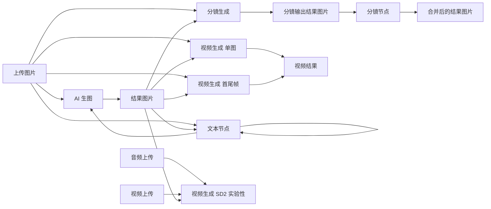

# 画布节点产品与交互说明

> 用途：把当前画布的节点定义、创作关系、内容引用、交互细节整理成一份可迁移的产品说明。本文只描述用户看得到的功能与行为，不约束另一项目采用何种技术实现。

## 1. 产品总原则

这是一块以“创作过程可见、结果可追溯”为核心的无限画布。用户不是在一张表单中一次完成创作，而是在画布上逐步放入素材、组织意图、生成结果、继续加工结果。

应保留以下产品原则：

1. **素材不被覆盖。** 上传、生成、裁剪、标注、切割等操作都会保留原节点；新的内容在右侧或附近成为新的结果节点，并用连线表达来源。
2. **连线就是引用关系。** 只有主动连上的文字、图片、音频或视频，才会成为下游节点的创作上下文。画布上未连接的内容不会被默认带入。
3. **生成由用户显式触发。** 新建连线、调整上游内容、替换素材都不会自动重新生成；用户点击“生成”时，节点才读取当时的输入。
4. **生成使用当次快照。** 发起后即使用户继续修改画布，正在进行的任务仍按点击时的内容完成，避免结果与后来画布状态混淆。
5. **结果可以继续流转。** 图片、文字和视频结果都可以接到后续节点，形成可分支、可回溯的创作链。
6. **注释与创作分离。** 笔记类内容可以放在画布上辅助沟通，但不会意外参与生成。

## 2. 节点角色总览

| 节点 | 角色 | 创建方式 | 可引用的内容 | 可向后续提供的内容 | 一句话定义 |
| --- | --- | --- | --- | --- | --- |
| 上传图片 | 素材源 | 手动创建 | 无 | 图片 | 将本地图片放入画布，作为后续创作的原始素材。 |
| AI 生图 | 创作节点 | 手动创建 | 图片、文字 | 图片 | 使用提示词和参考图生成一张或多张新图片。 |
| 结果图片 | 结果节点 | 自动创建 | 图片 | 图片 | 承载图片生成、裁剪、标注、分镜合并等操作的实际产物。 |
| 文本节点 | 创作节点 | 手动创建 | 文字、图片 | 文字 | 把上游文字、参考图片与本地输入整理为可继续编辑和复用的文字。 |
| 文本注释 | 说明节点 | 手动创建 | 无 | 无 | 记录 Markdown 笔记，不参与任何创作链路。 |
| 分镜生成 | 创作节点 | 手动创建 | 图片 | 图片 | 编排多格镜头描述并生成一张完整分镜图。 |
| 分镜节点 | 结构化结果节点 | 由“切割分镜”自动创建 | 图片 | 图片 | 将一张分镜图拆成可编辑、可排序、可再合并的单格镜头。 |
| 视频生成（单图） | 创作节点 | 手动创建 | 1 张图片 | 视频 | 把一张参考图和提示词转化为视频。 |
| 视频生成（首尾帧） | 创作节点 | 手动创建 | 恰好 2 张图片 | 视频 | 用首帧和尾帧约束视频的起止画面。 |
| 视频结果 | 结果节点 | 自动创建 | 视频 | 视频 | 展示视频生成状态和成片，并作为视频素材继续引用。 |
| 音频上传 | 素材源 | 手动创建 | 无 | 音频 | 上传音频，供 SD2 视频生成引用。 |
| 视频上传 | 素材源 | 手动创建 | 无 | 视频 | 上传已有视频，供 SD2 视频生成引用。 |
| 视频生成（SD2） | 实验性创作节点 | 手动创建 | 图片、音频、视频 | 视频（规划） | 已有多模态、编辑和延长视频的交互外壳，但当前不产生实际视频结果。 |
| 分组 | 组织节点 | 多选后创建 | 无 | 无 | 将多个节点放入一个可整体移动的容器。 |

补充说明：音频上传引用、视频上传引用是同一类素材节点的内部别名，不应在迁移后的用户菜单中作为额外节点重复出现。

## 3. 画布通用交互

### 3.1 新建节点与创建连线

- 在画布空白处**双击**或**右键**，打开完整节点菜单。菜单为双栏，包含用户可直接创建的节点。
- 从节点边缘的连接点拖到空白处，会打开一栏“下一步可用节点”菜单；用户选中后，系统在落点创建节点并自动补上连线。
- 从输入侧拖到空白处时，菜单展示可作为当前节点输入的素材或节点；从输出侧拖到空白处时，菜单展示可接收当前内容的下游节点。
- 连线有明确方向，只允许内容兼容的连接，且不能形成循环依赖。
- 普通节点的连接点在悬停时出现；开始连线时保持可见。多选多个可输出内容的节点时，可使用共享连接点一次把多项内容连到同一目标。

### 3.2 选择、移动与排布

- 单击选中节点；框选或组合键可多选。
- 节点可拖动；靠近其他节点的边缘或中心线时会吸附对齐。可选网格吸附，网格也可显示或隐藏。
- 右下角的缩放手柄仅在悬停时出现，可调整节点尺寸；图片节点在调整中优先保持图片比例。
- 按住 `Alt/Option` 拖动节点，可边拖边生成副本；复制多个节点时，内部连线也会一并保留。
- 多选至少两个节点后可分组；组内成员随容器整体移动。选中分组后可解散，成员不会被删除。
- 右键节点可复制、生成副本、粘贴或删除；双击连线，或选中连线后使用断开操作，可移除连线。

### 3.3 常用快捷操作

| 操作 | 快捷键 |
| --- | --- |
| 选择工具 | `V` |
| 平移工具 | `H` |
| 临时平移 | `Space` |
| 复制 / 粘贴节点 | `Cmd/Ctrl + C` / `Cmd/Ctrl + V` |
| 撤销 / 重做 | `Cmd/Ctrl + Z` / `Cmd/Ctrl + Shift + Z` 或 `Cmd/Ctrl + Y` |
| 分组 | `Cmd/Ctrl + G` |
| 删除选中内容 | `Delete` / `Backspace` |

当焦点位于输入框、文本域或可编辑文字内时，画布快捷键不应抢占输入行为。

### 3.4 选中态与媒体查看

- 节点被选中后，显示轻量的浮动操作条。操作条随节点位置移动，且按节点类型显示适用动作。
- 选中顶层图片节点时，节点下方显示文件名和图片尺寸；长文件名截断，不挤压尺寸信息。
- 双击顶层图片可进入大图查看：支持缩放、拖拽查看，以及在同一分组内的图片之间前后切换。
- 多选图片时支持批量下载；图片和视频结果可下载到指定位置，图片也可复制到剪贴板。

### 3.5 图片通用操作

适用于有实际图片内容的图片节点（上传图片、结果图片，以及具备可处理图片的生成节点）：

- **重新上传：** 仅上传图片节点可用，用新文件替换该素材节点当前内容。
- **裁剪：** 在弹窗中调整裁剪区域，确认后新增并连线一个结果图片节点。
- **标注：** 在弹窗中对图片进行绘制或标记，确认后新增并连线一个结果图片节点。
- **切割分镜：** 将一张分镜图按指定行列拆成分镜节点；若图片本身来自分镜生成并带有格子信息，行列会自动带出。
- **下载、复制、删除：** 不改变原有的创作关系；删除节点时，与它相连的关系一并清理。

以上“加工”都遵循非覆盖原则：原图留在画布上，新产物作为新节点出现。

## 4. 内容关系与流转图

图中的箭头表达“内容可作为后续创作上下文”，并不意味着一连线就自动执行。视频生成（SD2）当前只保留输入和界面关系，不能作为已完成的成片链路迁移。

## 5. 引用、顺序与内容传递规则

### 5.1 四类可传递内容

| 内容 | 典型来源 | 典型去向 | 使用方式 |
| --- | --- | --- | --- |
| 图片 | 上传图片、结果图片、分镜节点 | AI 生图、文本节点、分镜生成、视频生成、SD2 视频生成 | 作为视觉参考、素材或待加工对象。 |
| 文字 | 文本节点 | 文本节点、AI 生图 | 作为可组合的提示词或创作上下文。 |
| 音频 | 音频上传 | SD2 视频生成 | 作为视频生成的声音参考。 |
| 视频 | 视频上传、视频结果 | SD2 视频生成、视频结果 | 作为待编辑、待延长或后续引用的视频素材。 |

文本注释和分组没有可传递内容，它们只承担说明与组织作用。

### 5.2 引用是显式且有序的

- 每条连线都代表一次明确引用。断开连线后，下游节点不再使用该内容。
- 同一节点收到多项文字或多张图片时，文字和图片分别形成各自的有序列表；新接入的内容默认排在最后，用户可在节点内调整顺序或移除某一项。
- 文字的顺序会影响下游最终提示词的拼接顺序；图片的顺序会影响其展示顺序和 `@图N` 编号。
- 只改变上游内容或排序，不会自动运行下游。下次点击生成时才会读取最新关系。

### 5.3 文字节点的“有效文字”

文本节点同时保存两种文字：

1. **本地输入：** 用户在节点里持续编辑的原始要求。
2. **生成结果：** 最近一次成功生成后得到、且允许用户继续手改的结果。

有效文字规则如下：

- 尚未得到非空生成结果时，有效文字 = 按用户排序的上游有效文字 + 本地输入；各段之间保留空行。
- 一旦生成成功，生成结果成为该节点对下游提供的有效文字。
- 用户可直接改写结果；改写后，下游引用的是改写后的版本。
- 清空结果等同于清除结果，节点重新回退为“上游文字 + 本地输入”。
- 再次生成时，始终重新读取当前上游与本地输入，不把旧结果作为下一次生成的输入。

### 5.4 图片引用与 `@图N`

- 图片编辑、文本、分镜和视频节点中的 `@图N` 不是普通文字，而是对当前第 N 张已连接图片的可见引用标签。
- 标签应与具体图片连接绑定：断开相应图片后，相关标签一起失效或移除，不能留下指向不存在素材的引用。
- 在支持该能力的节点中，悬停 `@图N` 可预览对应图片，帮助用户确认引用对象。
- 图片编号跟随当前图片顺序变化；调整顺序后，应同步更新编号语义，避免“文字描述”与实际素材不一致。

### 5.5 提示词的组合方式

- AI 生图在执行时，将已连接文本节点提供的有效文字按用户排序组合，再把当前图片节点自己的本地提示词追加在最后。
- 文本注释不参与上述组合。
- 图片、分镜和视频节点的“润色”只改写本节点正在编辑的提示词或分镜格描述；不会改写上游内容，也不会覆盖已完成的结果。

### 5.6 生成快照、状态与结果

- 点击生成时，节点冻结当前的提示词、引用素材和关键参数，作为本次生成依据。
- 等待期间可继续操作画布；进行中的任务不会追随之后的画布修改。
- 生成完成后，新的结果节点与发起节点相连。失败则在结果位置保留可见失败状态，便于复制错误内容或重新调整后再试。
- 已有结果不会因为上游被替换、删除或重新生成而被悄悄改写。用户可以保留多个分支进行对比。

### 5.7 分镜的结构信息

- 分镜生成不仅得到一张多宫格图片，也保留行列和每格描述的意义。
- 将这类图片切割为分镜节点时，系统应恢复对应网格，减少用户重复设置。
- 分镜节点再次合并输出时，应继续携带行列和格子备注，使这张新分镜图仍可被可靠地再次切割。

## 6. 各节点详细说明

### 6.1 上传图片

**定位：** 画布的基础图片素材入口。

**卡片布局：**

- 空态为居中的上传图标与上传引导区域。
- 有图后，图片铺满节点主体，优先展示清晰的预览图。
- 选中时，在节点下方显示“文件名 + 原始尺寸”；右下角保留缩放手柄。
- 节点边缘提供对外引用的连接点。

**交互与功能：**

- 可点击上传，也可将图片拖入节点；选中上传节点时可直接粘贴剪贴板图片。
- 上传完成后，节点成为图片来源，可接给图片、文字、分镜和视频创作节点。
- 重新上传会更新当前素材节点；已完成的历史结果保持不变，后续新生成才读取替换后的图片。
- 可使用图片通用操作：复制、下载、裁剪、标注、切割分镜、删除。

**不承担的职责：** 不接收上游输入，不直接生成新图片。

### 6.2 AI 生图

**定位：** 将文字意图与参考图片组合成新图片的核心创作节点。

**可引用内容：** 图片与文字。图片是视觉参考，文字是提示词上下文。

**卡片布局：**

- 上部为已连接图片的参考区，展示缩略图和引用状态。
- 中部为本地提示词编辑区，可在文字中使用图片引用标签。
- 下部为紧凑控制条：模型、清晰度、画幅比例、一次生成数量，以及模型配置与提示词润色入口。
- 底部以“生成”为主要操作；节点两侧分别承担输入和向后续传递图片的连接关系。

**交互与功能：**

- 可只用文字生图，也可组合一张或多张参考图进行图生图。
- 上游文本按用户排列顺序加入提示词，本地提示词始终追加在最后，避免节点自身的明确要求被上游文字覆盖。
- 支持 `1`、`2`、`4` 张输出。每一张都会形成独立的结果图片节点，便于挑选、比较和分别继续加工。
- 点击润色后，当前本地提示词会被改写得更适合图片生成；上游文字和已生成图片不受影响。
- 点击生成后立即在结果位置创建等待状态，成功或失败都保留在同一位置。
- 结果遵循来源节点专属的右向轨道：单张居中接在右侧，2 张为竖排比较条，4 张为 2×2 网格；同一节点再次生成时，新一批结果继续向右延展。
- 右侧遇到其他节点时，结果只会在右向轨道内向上、下或更右避让，不会自动跳到来源左侧，也不会自动缩放或重置画布视角。

**关键边界：** 调整参考图、文字或参数后，必须再次点击生成才会影响新结果。

### 6.3 结果图片

**定位：** 承载所有“新图片产物”的通用结果节点。

**来源：** AI 生图、分镜生成、裁剪、标注、分镜合并，以及对单格分镜图的编辑。

**卡片布局：**

- 成功时为可缩放的完整图片预览。
- 等待时覆盖进度提示，保留该结果将出现的位置。
- 失败时以醒目的错误状态替代空白图片，并提供复制错误内容的操作。
- 选中时显示文件名与尺寸；右下角提供缩放手柄。

**交互与功能：**

- 可继续作为图片素材接入文字、AI 生图、分镜生成、视频生成或 SD2 视频生成。
- 可再次裁剪、标注、切割分镜；每一次加工继续产生新的结果节点，不修改当前结果。
- 支持大图查看、复制和下载。

### 6.4 文本节点

**定位：** 画布上的可生成、可编辑、可复用文字工作单元；不同于仅做笔记的文本注释。

**可引用内容：** 上游文字与图片。最多可连接 10 张图片作为视觉上下文，实际可用数量还会受用户所选模型能力限制。

**卡片布局：**

- 顶部为上游上下文区：文字以条目形式显示，图片以缩略图显示；两类内容可各自排序、定位或断开。
- 中部为本地文字输入区，用来补充明确要求；已连接图片可作为可视引用使用。
- 结果区在生成后显示可直接编辑的结果文字；用户可清空结果，回到组合输入状态。
- 底部为模型与思考强度选择、润色入口，以及“生成 / 停止”主操作。

**交互与功能：**

- 可以串联：一个文本节点的有效文字可成为另一个文本节点的上游内容。
- 可把图片接入文本节点，让文字生成参考画面内容。
- 用户能在生成后直接修改结果，这个修改后的版本立即成为下游可引用文字。
- 在生成中可停止；停止后迟到的生成结果不应覆盖用户当前的内容。
- 润色只处理节点里的本地输入，不改变上游文字、图片或既有结果。

**关键边界：** 文本节点不是聊天窗口。它不自动随上游更新，也不应将隐藏推理过程传给下游。

### 6.5 文本注释

**定位：** 自由记录创作说明、会议备注、待办或规则的画布便签。

**卡片布局与交互：**

- 选中时进入 Markdown 编辑状态；失焦后展示排版后的阅读预览。
- 支持移动、缩放、复制、分组和删除。
- 没有输入或输出连接点，也不显示在“从连线继续创建”的候选中。

**关键边界：** 它永远不应被拼入提示词，也不应影响任何生成。

### 6.6 分镜生成

**定位：** 用一个节点完成多格镜头规划和多宫格分镜图生成。

**可引用内容：** 图片。连接的图片可作为整体风格、人物、场景或画面参考。

**卡片布局：**

- 顶部是网格设置区，使用行、列步进器定义分镜数量；当前范围为每个方向 `1` 至 `9` 格。
- 紧邻设置区的是整体提示词，描述统一的风格、剧情或画面约束。
- 主体是与实际网格一致的分镜格。每格有单独描述输入和单格润色按钮。
- 格子内和整体提示词都可使用 `@图N` 引用已连接图片；悬停标签可预览素材。
- 底部提供模型、清晰度、画幅控制与生成按钮。

**交互与功能：**

- 改变行列后，格子自动按新的数量重建，用户不需要手动增加或删除镜头条目。
- 生成时，把整体提示词、每格描述、网格结构与参考图片组合为一张完整多宫格分镜图。
- 输出以“结果图片”呈现，并带有网格和每格备注信息；可直接下载、继续接入下游，或通过“切割分镜”转为可编辑格子。
- 单格润色只修改目标格的描述，适合逐镜头加强表达。

**关键边界：** 该节点生成的是一张完整分镜图，不是自动生成多个彼此独立的图片节点。

### 6.7 分镜节点（切割结果）

**定位：** 把分镜图变成可逐格管理的镜头资产集合。

**来源：** 用户在图片节点上执行“切割分镜”后自动创建；不出现在普通新建节点菜单中。

**卡片布局：**

- 主体按行列展示每一个分镜格，格内包含图片和可编辑备注。
- 格子顺序可通过拖拽调整；每格可以单独编辑、替换为上游图片或作为单独资产处理。
- 合并设置集中在节点内，可控制是否显示格号、是否显示备注、备注位置、图片填充方式、格间距、边距、字号与颜色等视觉信息。
- 节点提供合并输出和单格打包下载等操作。

**交互与功能：**

- 切割后，每格保留独立图片资产和镜头备注，便于在分镜评审中调整顺序和文案。
- 可把多个格子按当前顺序重新合并为一张分镜结果图片；合并图保留结构信息，以便之后再次切割。
- 可导出单格图片包，适用于把镜头交给后续制作流程。
- 可复制整个分镜文本，方便同步镜头描述。

**关键边界：** 分镜节点是结构化编辑容器，不应把它伪装成普通单张图片上传节点。

### 6.8 视频生成（单图）

**定位：** 以一张参考图为视觉起点生成视频。

**输入要求：** 必须且只能引用 1 张图片。

**卡片布局：**

- 上部展示单张参考图预览和当前引用状态。
- 中部是视频提示词输入区，支持 `@图N` 标签和素材悬停预览。
- 下部为紧凑参数区：模型、分辨率、时长，以及镜头类型、景别、角度、运镜方式、运镜速度等镜头预设。
- 高级选项收纳音频、固定镜头、水印、样片、联网搜索、随机种子等能力；是否出现取决于所选模型。
- 底部以“生成视频”为主操作。

**交互与功能：**

- 图片决定画面基调，提示词描述动作、镜头语言和场景变化。
- 可使用提示词润色；润色只更新当前视频提示词。
- 提交后，在右侧或附近自动创建视频结果节点并显示进度。
- 若生成的是样片结果，视频结果节点可提供“生成正式视频”的后续操作。

### 6.9 视频生成（首尾帧）

**定位：** 用起始画面和结束画面约束视频变化过程。

**输入要求：** 必须恰好引用 2 张图片，且两张图片分别落在明确标记的“首帧”和“尾帧”位置。

**卡片布局与功能：**

- 与单图视频生成节点保持相同的提示词区、模型参数区和高级选项区。
- 输入区展示两个固定位置，而不是按连线先后随意排列；首帧始终代表起始画面，尾帧始终代表结束画面。
- 两张图片都齐全后才允许按首尾帧语义生成视频；结果同样以独立视频结果节点呈现。

**关键边界：** 首尾帧含义由连接到哪个位置决定，不能只按用户“先连了哪一张”推断。

### 6.10 视频结果

**定位：** 视频生成任务的可见承载点，也是可继续引用的视频资产。

**卡片布局：**

- 成功后，主体为视频播放器。
- 等待时显示进度和等待时长；失败时显示明显错误状态，并允许一键复制错误内容。
- 成片右上角可打开或收起详情面板，查看提示词、模型、分辨率、时长、声音、种子等本次生成信息。
- 选中后的操作包含下载、复制视频地址、复制提示词等。

**交互与功能：**

- 视频结果保留与发起视频生成节点的连线，便于回溯来源。
- 可作为视频素材接入后续视频流程，尤其是 SD2 视频编辑或延长模式。
- 样片结果可触发正式成片生成，新的正式成片仍以新的视频结果节点出现，不覆盖样片。

### 6.11 音频上传

**定位：** 为多模态视频创作提供声音素材。

**卡片布局与交互：**

- 空态支持点击或拖入音频文件。
- 上传后显示文件名、播放/暂停控制、进度条和时长。
- 可向后续提供音频，但自身不接收其他内容。

**当前去向：** 视频生成（SD2）的多模态参考。

### 6.12 视频上传

**定位：** 为视频编辑、延长或多模态参考提供已有成片。

**卡片布局与交互：**

- 空态支持点击或拖入视频文件。
- 上传后显示视频预览播放器和文件信息。
- 可向后续提供视频，但自身不接收其他内容。

**当前去向：** 视频生成（SD2）的编辑、延长或多模态参考。

### 6.13 视频生成（SD2）

**定位：** 面向多模态视频生成、视频编辑和视频延长的下一代视频节点。

**当前状态：** **实验性界面能力，尚未打通实际生成闭环。** 可以创建、连接素材、填写参数和切换模式，但“生成视频”目前不会创建实际视频任务或结果节点。迁移时必须把它标为规划能力，而不能当成已交付的视频生成功能。

**可引用内容：** 图片、音频、视频。

**三种界面模式：**

| 模式 | 用户意图 | 主要素材关系 |
| --- | --- | --- |
| 多模态参考 | 用多种素材共同定义新视频 | 可组合图片、音频和视频引用。 |
| 编辑视频 | 基于已有视频做内容修改 | 以视频为主素材，再补充提示词和可选参考。 |
| 延长视频 | 延续已有视频片段 | 以视频为连续起点，补充延长方向或场景要求。 |

**卡片布局：**

- 顶部用于选择生成模式并展示已引用素材数量。
- 中部为提示词和引用素材区域，素材以标签或缩略预览呈现。
- 下部为模型、画幅、分辨率、时长、声音、水印、末帧等设置；不同模型显示不同的可选项。
- 底部保留“生成视频”主按钮，当前只能作为未来能力的占位。

### 6.14 分组

**定位：** 画布层面的空间组织工具，而非内容处理节点。

**交互与功能：**

- 选中两个及以上节点后创建，容器自动包住成员并留出边距。
- 组内节点整体移动，原有连线和节点内容不改变。
- 可复制整组、移动整组或解散分组；解散只取消容器关系，成员继续保留。
- 不提供任何内容输入、输出或生成操作。

## 7. 自动产生的节点与可见状态

| 自动节点 | 出现时机 | 用户看到的状态 | 后续可做什么 |
| --- | --- | --- | --- |
| 结果图片 | 图片生成、裁剪、标注、分镜合并或单格编辑提交后 | 等待、成功图片、失败错误 | 查看、下载、复制、继续引用、再次加工。 |
| 视频结果 | 视频生成提交后 | 等待、成功播放器、失败错误、样片 | 下载、复制信息、作为视频素材、样片转正式成片。 |
| 分镜节点 | 对图片执行切割分镜后 | 可编辑的单格网格与备注 | 排序、编辑、合并、导出单格。 |
| 分组 | 多选后分组 | 包含成员的容器 | 整体移动、解散。 |

等待与失败状态不能被设计成“什么都没有发生”。它们要稳定占据预期结果位置，让用户知道任务的来源、当前进度和可恢复入口。

## 8. 推荐的典型创作链路

### 8.1 从素材到多轮图片迭代

1. 上传图片作为人物、场景或风格素材。
2. 用文本节点整理需求，必要时让文本节点参考上传图片。
3. 将文本和图片接入 AI 生图，生成多个候选结果。
4. 从候选结果分支出裁剪、标注、再次生图或分镜生成。
5. 保留所有结果并排比较，选择其中一支继续推进。

### 8.2 从剧情到分镜

1. 用文本节点写出整体剧情与镜头方向。
2. 上传角色或场景参考图，并接入分镜生成节点。
3. 设定行列、整体风格和每格镜头描述；在需要处引用具体图片。
4. 生成完整分镜图。
5. 切割为分镜节点，逐格调整备注、顺序和视觉内容。
6. 导出单格，或重新合并为带镜头信息的分镜图。

### 8.3 从图片到视频

1. 将选中的结果图片接到视频生成（单图），或接到视频生成（首尾帧）的首帧、尾帧位置。
2. 写入动作、镜头和节奏描述，按模型支持范围设置视频参数。
3. 显式点击生成，等待视频结果节点出现成片。
4. 下载成片，或以视频结果为素材进入后续视频编辑/延长流程。

## 9. 迁移到另一项目时必须保持的产品契约

以下行为是“按当前定义实现”的核心，不应因换项目而弱化：

1. **显式引用：** 只有连线内容进入下游，注释和未连接内容绝不隐式带入。
2. **非破坏性产物：** 每次生成和图片加工都新增结果，原节点始终可回看。
3. **结果优先的文字语义：** 文本节点有结果时，下游拿结果；清空结果才回到组合输入。
4. **可控的输入顺序：** 多段文字、多张图片均可排序，且顺序真实影响下次生成。
5. **固定的首尾帧语义：** 首帧和尾帧由位置决定，不由连线时间决定。
6. **可追溯的分镜：** 分镜图、切割格、重新合并图之间必须保留可读的网格与备注关系。
7. **用户显式执行：** 上游变化不自动重跑，下游生成有明确按钮和等待/失败状态。
8. **图片引用标签可靠：** `@图N` 必须与实际素材绑定、可预览，断线后不能留下失效引用。
9. **实验功能如实标注：** SD2 节点在真正具备结果闭环前，只能作为实验性流程设计，不可宣传为可用生成。

## 10. 建议的落地优先级

为了让另一项目尽快获得与当前画布一致的核心体验，可按以下顺序迁移：

| 优先级 | 范围 | 验收重点 |
| --- | --- | --- |
| P0 | 画布、选中/移动/缩放、显式连线、上传图片、AI 生图、结果图片、文本节点、文本注释 | 能完成“图片 + 文字 → 生图 → 结果继续引用”的非破坏性闭环。 |
| P1 | 图片裁剪、标注、分组、图片查看、复制下载、分镜生成、分镜切割与合并 | 能完成“创作 → 分镜 → 单格资产 → 再组合”的结构化流程。 |
| P2 | 单图视频、首尾帧视频、视频结果、音频上传、视频上传 | 能完成真实的视频任务、进度、失败、下载和成片复用。 |
| 实验性 | SD2 视频节点 | 先复用三种模式和素材引用交互；在真实生成闭环完成前，明确标识为实验功能。 |

## 11. 迁移验收清单

- 从空白画布能新建所有面向用户的节点；自动节点不会误出现在常规菜单中。
- 从任一节点拖线到空白处时，只看到兼容的下一步节点。
- 用同一张图片分支生成两组结果时，原图片和两组结果都保留且关系清晰。
- 文本节点在生成成功后，编辑结果文字能立即改变下游收到的内容；清空结果后能回退到组合输入。
- 调整上游内容或连线顺序后，下游不会自动运行；再次点击生成才读取新内容。
- `@图N` 可以预览正确图片；断开图片后不会留下无效标签。
- 首尾帧视频必须拒绝缺少首帧、尾帧或图片数量不正确的生成。
- 分镜生成的行列、格子描述、切割结果和重新合并结果之间可以往返保持语义。
- 等待、成功、失败、停止等状态都有稳定、明确且不遮挡关键操作的展示。
- 上传、结果图片和视频结果都支持用户预期的查看、复制和下载路径。
- SD2 节点在没有真实执行结果前始终显示为实验性，不能造成“已经开始生成”的错觉。
