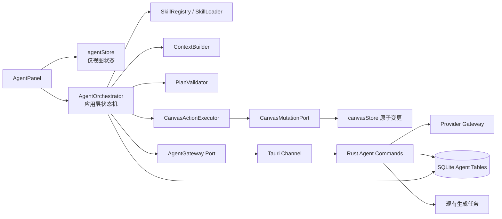

# OpenCanvas 画布 Agent 综合技术方案与开发交接说明

> 状态：待实施方案
>
> 编写日期：2026-08-08
>
> 本文档用途：为后续实现会话提供唯一的执行入口。本文不包含业务代码；实现时应按阶段完成并逐项验证。

本文把 OpenCanvas 的安全与架构约束和 Canvex 已验证的创作交互合并为一套实施方案：OpenCanvas 负责权限、审批、版本、原子变更、撤销、测试和可替换性；Canvex 的引用、Prompt Block、空间标注、异步占位任务、多图输入、稳定布局和流式反馈负责把能力变成连续、可理解的创作体验。实现时不得把 Canvex 的 Django/Celery/Redis/PostgreSQL 技术栈直接搬入 Tauri；只吸收其领域协议和交互语义。

## 1. 阅读入口

本方案建立在已有调研之上。产品定位、竞品交互、风险分级和总体能力范围见：

- [右侧画布 Agent 功能设计与技术调研](./2026-08-08-canvas-agent-feature-design-and-technical-research.md)

后续实现会话先阅读该文档的第 1、6、7、9、10、12、13、14、18、21 节，再阅读本文第 2 至 19 节。若只处理图片编辑或生成任务，必须额外阅读本文第 5.3 至 5.9、11.1 至 11.7 和 12.2 至 12.3；若只处理审批或画布写入，必须阅读本文第 6、9、15 和 16 节。

本文是实现约束的补充，不替代项目根目录的 `AGENTS.md`。若本文与用户新要求冲突，以用户要求为准；若本文与稳定的架构约束冲突，应先更新本文和相关决策记录。

## 2. 最终技术决策

### 2.1 推荐组合

OpenCanvas 采用以下分层组合：

| 层 | 决策 | 责任边界 |
| --- | --- | --- |
| 产品编排 | 自有 `AgentOrchestrator` | 澄清、计划、审批、版本校验、应用变更、运行和恢复 |
| Agent loop | 优先使用 Vercel AI SDK Core `ToolLoopAgent` 的 loop 能力；如 Tauri 运行边界不适合，则使用同一协议自研薄 loop | 多轮工具调用、停止条件、结构化输出、流式事件 |
| Skill | OpenCanvas 自有 `SkillRegistry` 和 `SkillLoader` | Skill 版本、触发、上下文、工具权限、节点兼容性、评测 |
| 画布写入 | `CanvasChangeSet` + `CanvasActionExecutor` | 变更集验证、原子提交、单步历史、整批撤销 |
| 任务编排 | 自有 `CanvasJobService` | 占位节点、幂等提交、状态流、结果替换、取消和重启恢复 |
| 模型网关 | 现有 Tauri/Rust `AiGateway` 扩展为 `AgentGateway` | API Key、供应商适配、流式、取消、错误归一化 |
| 运行持久化 | SQLite 独立 Agent 表 | 会话、消息、运行、工具调用、审批和事件索引 |
| UI | React Agent feature + 独立 Agent Store | 面板、消息、澄清卡、计划卡、执行时间线、错误和恢复 |

这不是把 SDK 当作业务架构，而是把 SDK 限定为可替换的 loop 引擎。画布事实、权限、Skill 和持久化始终归 OpenCanvas 所有。

### 2.2 为什么不直接采用完整 Agent 框架

当前产品是 Tauri 桌面端、单项目、已有 Rust 网关和 SQLite，并且 Agent 的关键流程是受约束的“理解 → 计划 → 审批 → 执行”状态机。完整框架通常会带来自己的运行时、Session、Memory、Storage、HTTP Server 或 Sandbox，与当前边界重复。

首版直接引入 Mastra、LangGraph 或完整 Pi coding agent，会增加部署、权限和数据源冲突。只有当长运行恢复、后台调度、多 Agent 协作成为主要需求时，才引入更重的 runtime。

### 2.3 备选和使用条件

- `@ai-sdk/harness-pi`：用于 POC 或通用创作助手实验。它目前是实验性 Harness API，Pi 在 Node 主进程运行并依赖 Sandbox，不作为画布事实源。
- Mastra：若产品转为云端、多用户、Node 服务，且需要一等 Skill、Memory、Workflow、Storage 和 Observability，可作为服务端 runtime。
- LangGraph：若需要复杂分支、长时间运行、跨进程 checkpoint、动态 interrupt 和可视化状态图，再评估 LangGraph.js。
- OpenAI Agents SDK：仅在明确 OpenAI-only、需要官方 handoff、tracing、Session 和 Sandbox 时作为独立方案，不作为当前多供应商核心抽象。

## 3. 目标与边界

### 3.1 P0 必须完成

1. 右侧 Agent 面板可以建立和恢复项目会话。
2. Agent 可以读取经过授权的画布上下文和选中节点。
3. Agent 能先提出关键澄清问题，再返回结构化计划。
4. 用户可以逐项查看计划，批准、拒绝或修改计划。
5. Agent 通过 `CanvasChangeSet` 创建节点、更新白名单字段、连线和请求运行。
6. 变更集通过校验后一次性应用，并形成一个可撤销历史步骤。
7. 文生图和图生图任务可提交到现有生成任务体系，状态可流式显示。
8. 支持停止当前运行、错误恢复和整批撤销。
9. Skill 可以按项目启用、禁用、版本化，并在运行记录中保留快照。

### 3.2 P0 明确不做

- Agent 直接操作任意文件系统、shell、网络或凭据。
- Agent 直接修改 Zustand、React Flow 内部字段或整个画布快照。
- 没有审批的批量生成、删除、覆盖原节点或高成本调用。
- 让模型自行决定未注册的节点类型、模型 ID、端口类型和绝对坐标。
- 首版引入多 Agent 网络、长期后台调度、团队协作和跨设备同步。

## 4. 当前代码库约束

后续实现必须沿着“UI 输入 → Store → 应用服务 → 基础设施 → Tauri/Rust → SQLite/供应商”的数据流进行。

关键事实：

- `Canvas.tsx`、`canvasStore.ts` 已超过舒适规模，Agent 逻辑不能继续堆入其中。
- `nodeRegistry.ts` 是节点类型、默认数据、菜单和基础连线能力的单一真相源。
- `canvasStore` 已有细粒度增删改、布局和 undo/redo，但这些操作不能直接作为 Agent 写接口。
- `projectStore` 已负责项目自动持久化和图片池去重，Agent 数据需单独存储。
- Rust 已有 `AiGateway`、异步生成任务和 `polish_text`；`polish_text` 是一次性文本润色命令，不应改造成 Agent loop。
- 生成任务最终仍应复用现有 `ai_generation_jobs` 和结果节点链路。
- 密钥不能进入 React/WebView bundle。直接在前端调用供应商只允许在明确的本地代理和权限方案下进行。

## 5. 目标架构



### 5.1 前端模块

建议新增 `src/features/agent/`，按以下职责拆分：

| 路径 | 职责 |
| --- | --- |
| `domain/agentTypes.ts` | 会话、消息、运行、计划、审批、事件和状态类型 |
| `domain/changeSet.ts` | `CanvasChangeSet` 及语义操作类型 |
| `domain/skillTypes.ts` | Skill metadata、manifest、版本和能力声明 |
| `application/agentOrchestrator.ts` | Agent loop、阶段转换、恢复和取消 |
| `application/contextBuilder.ts` | 画布、选择、节点和附件上下文裁剪 |
| `application/planValidator.ts` | Schema、权限、节点、模型、连线和修订校验 |
| `application/canvasActionExecutor.ts` | 变更集到原子画布操作的转换 |
| `application/canvasJobService.ts` | 占位节点、任务幂等、状态同步、结果替换和恢复 |
| `application/placementService.ts` | `PlacementIntent` 解析、碰撞检测和稳定 slot 布局 |
| `application/skillResolver.ts` | 根据意图、上下文和项目设置选择 Skill |
| `application/ports.ts` | AgentGateway、Repository、Mutation、Context 等接口 |
| `infrastructure/tauriAgentGateway.ts` | Tauri 命令调用、Channel 事件和取消 |
| `infrastructure/tauriAgentRepository.ts` | 会话、运行和消息持久化适配 |
| `ui/AgentPanel.tsx` | 面板壳层和布局 |
| `ui/AgentMessageList.tsx` | 消息、工具调用和流式内容 |
| `ui/ClarificationCard.tsx` | 澄清问题和选项 |
| `ui/PlanCard.tsx` | 计划、风险、预览和审批 |
| `ui/RunTimeline.tsx` | 运行步骤、进度、失败和重试 |
| `ui/ContextPicker.tsx` | 当前选择、节点、画布和附件范围 |

`agentStore.ts` 只保存面板开关、当前会话 ID、输入草稿、展示状态和乐观 UI 进度，不承载 loop、校验或持久化业务。

### 5.2 Rust 模块

建议新增：

| 路径 | 职责 |
| --- | --- |
| `src-tauri/src/commands/agent.rs` | 启动回合、继续回合、审批、取消、会话 CRUD |
| `src-tauri/src/agent/schema.rs` | Tauri 请求、响应、流事件和错误 DTO |
| `src-tauri/src/agent/provider.rs` | 供应商中立的文本流和工具调用端口 |
| `src-tauri/src/agent/providers/*` | Chat、Responses 和供应商原生协议适配 |
| `src-tauri/src/agent/persistence.rs` | Agent 表初始化、自愈、事务和查询 |
| `src-tauri/src/agent/cancellation.rs` | Abort token、任务取消和清理 |

Rust 不应执行画布 Store 操作。画布事实仍由前端应用层根据已验证变更集提交。

### 5.3 产品核心闭环

Agent 的最小价值单位不是“一段回答”，而是一次可追踪、可恢复、可撤销的创作回合。所有实现都应围绕以下闭环设计：

```text
用户选择图片/资源
  -> 在 AgentPanel 中引用 @节点 / @资源 / @selection
  -> Agent 读取授权上下文，必要时提出澄清
  -> Agent 生成 Prompt Block 和结构化 CanvasChangeSet
  -> PlanValidator 计算风险、费用、影响范围和版本前置条件
  -> 自动执行或等待用户批准
  -> CanvasActionExecutor 原子创建 Prompt Block、图片节点、连线和布局
  -> CanvasJobService 创建 pending 占位节点并提交异步任务
  -> Tauri Channel 流式推送工具状态、任务状态和结果引用
  -> 成功时原位替换占位节点，失败时保留可重试状态
  -> 项目重启后从 SQLite 恢复会话、运行和未完成任务
  -> 一次整批撤销移除本回合的画布引用，不删除外部资源文件
```

这条闭环是 P0 的黄金路径。任何新增工具都必须说明它在哪一步产生输入、在哪一步落画布、如何恢复、如何撤销，以及失败后用户看到什么。

### 5.4 画布引用协议

引用是 Agent 理解“用户说的是哪张图”的基础协议，不能用节点标题或图片 URL 做隐式匹配。输入框和消息 DTO 中使用稳定引用 token：

```text
@node:<nodeId>         明确引用一个画布节点
@resource:<resourceId> 明确引用图片池或项目资源
@selection             引用当前选中节点集合的快照
@previous-result       引用本回合最近一次成功结果
```

`ContextBuilder` 在构建模型上下文时解析 token，并返回带来源的 `AssetReference`：

```ts
interface AssetReference {
  kind: 'node' | 'resource' | 'selection' | 'previous-result';
  id: string;
  projectId: string;
  nodeType?: string;
  previewUrl?: string;
  originalAssetId?: string;
  role: 'source' | 'reference' | 'mask' | 'output';
  authorization: 'selected' | 'explicit' | 'derived';
}
```

引用规则：

1. 只解析当前项目、当前会话有权限的 ID；不存在、已删除或跨项目的引用返回结构化 `invalid_reference`，不能静默绑定同名节点。
2. `@selection` 在回合开始时冻结为 `selectionSnapshot`，回合中用户改变选区不会改变已经提交的请求。
3. 默认只发送节点类型、标题、摘要、尺寸、预览引用和必要参数；原图由 Rust 根据 `originalAssetId` 按需读取，避免在 React/WebView 和消息历史中复制 Base64。
4. `nearby` 上下游只在 Skill 要求或用户明确扩展范围时读取；不得因为“方便”把全画布塞进每次 prompt。
5. 计划和任务都保存解析后的 `referencedNodeIds`、`referencedResourceIds` 和资源哈希，供审批展示、重放和冲突检测。

### 5.5 Prompt Block：可编辑的意图对象

Prompt Block 是一等画布节点，表示用户和 Agent 协作形成的意图；它不是隐藏在消息中的字符串，也不是生图节点的临时字段。用户可以直接编辑 Prompt Block，再让下游图片节点使用它。

```ts
interface PromptBlockData {
  rawPrompt: string;
  resolvedPrompt: string;
  negativePrompt?: string;
  referencedNodeIds: string[];
  referencedResourceIds: string[];
  model?: string;
  aspectRatio?: string;
  resolution?: string;
  seed?: number;
  sourceAgentRunId?: string;
  status: 'draft' | 'approved' | 'submitted';
  revision: number;
}
```

职责必须分开：

- `Prompt Block` 保存用户可读、可继续编辑的意图和引用。
- `Image Node` 保存一次实际提交的模型、参数、输入资源哈希和 `promptSnapshot`。
- `CanvasJobBinding` 保存异步任务状态，不能把任务状态塞入提示词文本。

Agent 生成 Prompt Block 时应同时返回“保留内容”“修改内容”“不确定项”和“采用的模型参数”。用户修改 Prompt Block 后，必须提升其 `revision`；旧的图片任务仍使用提交时的快照，不回写覆盖新的用户意图。状态转换为：

```text
draft -> approved -> submitted
```

只读建议可以保持 `draft`；产生外部费用或创建任务前，Prompt Block 和对应计划必须进入 `approved` 或由风险策略明确标记为自动批准。

### 5.6 CanvasJobBinding 与异步占位节点

图片生成、图片编辑、视频、主体拆分和工具处理都通过一个 `CanvasJobService` 适配现有任务体系。Canvex 的“先有占位、后填结果”是体验协议，不要求复制其后端实现。

```ts
interface CanvasJobBinding {
  jobId: string; // OpenCanvas 本地任务 ID，在创建占位节点时生成
  providerJobId?: string;
  kind: 'image' | 'video' | 'tool' | 'subjectSplit';
  status: 'queued' | 'running' | 'succeeded' | 'failed' | 'cancelled' | 'orphaned';
  sourceNodeIds: string[];
  resultNodeIds: string[];
  placeholderNodeIds: string[];
  promptNodeId?: string;
  agentRunId?: string;
  idempotencyKey: string;
  slotIndex?: number;
  submittedAt: number;
  completedAt?: number;
  error?: { code: string; message: string; retryable: boolean } | null;
}
```

任务生命周期必须满足以下不变量：

```text
create placeholder
  -> persist placeholder + binding
  -> submit with idempotencyKey
  -> persist provider jobId
  -> poll/receive events
  -> succeeded: write result asset, replace placeholder in place
  -> failed: keep tombstone and retry action
  -> cancelled: keep cancellation reason, do not auto-retry
  -> reload: reconcile active jobs before allowing a second submit
```

实现要求：

- 前端复用现有 `ai_generation_jobs` 和结果节点链路；`CanvasJobService` 只是深模块，隐藏任务创建、查询、取消、重试和恢复细节。
- `job_queued` 事件必须携带完整结构化 binding，禁止从自然语言 tool result 中解析 job ID、URL 或节点 ID。
- `runId + idempotencyKey` 在本地和供应商适配器两侧都要幂等。网络超时后恢复运行时，先查询已有任务再决定是否提交。
- 占位节点预留最终输出的稳定尺寸和布局槽位。状态文本、进度、重试按钮不能造成节点尺寸跳变。
- 任务成功但源节点已删除时，binding 进入 `orphaned`：结果保留在资源池和运行记录中，不自动插入旧位置，用户可以选择恢复到新位置或仅保留资源。
- 撤销只移除 Prompt Block、占位/结果节点和边的画布引用；不得删除外部生成文件或用户原图。

### 5.7 图片二次编辑与标注空间提示

“导出带标注图片”和“让 AI 按标注修改图片”是两条不同的产品路径，不能共用同一个已烧入标注的输入文件：

| 路径 | 输入 | 结果 |
| --- | --- | --- |
| 标注导出 | 原图 + 标注图层 | 标注烧入像素的新文件，继续走现有工具处理链路 |
| AI 二次编辑 | 干净原图 + 结构化空间提示 | 新的图片结果节点，原图和标注节点保留 |

AI 编辑使用纯函数把画布标注转换成模型可理解的空间提示，避免把 UI 坐标或 React Flow 字段泄漏给模型：

```ts
buildSpatialEditPrompt({
  image: { width, height },
  annotations,
  userPrompt,
}): {
  prompt: string;
  regions: Array<{
    kind: 'point' | 'region' | 'association';
    x?: number;
    y?: number;
    x1?: number;
    y1?: number;
    x2?: number;
    y2?: number;
    label?: string;
  }>;
}
```

标准映射：

- arrow：使用起点/终点归一化坐标生成 `point` 或带方向的 `association`；
- rectangle/ellipse：生成图片百分比坐标的 `region`；
- text：与最近的形状或区域关联，无法关联时作为全局编辑要求并在计划中提示不确定；
- 所有坐标归一化到 `[0, 1]` 或图片百分比，适配不同分辨率和裁剪；
- prompt 必须包含“只修改指定区域，其他内容保持不变”的保留约束，除非用户明确要求全图风格变化。

标注转换器应有独立单元测试和可视化样例。不得修改现有 `CanvasToolProcessor` 的标注导出语义；新路径只在 `image-editing` Skill 和 `CanvasJobService` 中组合。

### 5.8 多图选择与能力矩阵

Agent 面板支持单图、带标注单图和多图三种输入模式。ContextBuilder 先生成选择能力，再由模型注册表和 Skill 求交集，禁止让模型猜测某个工具是否支持多图。

| 选择模式 | AI 编辑 | 抠图 | 主体拆分 | 视频/换视角 | 默认策略 |
| --- | --- | --- | --- | --- | --- |
| `single-image` | 可用 | 可用 | 可用 | 可用 | 自动允许 |
| `image-with-shapes` | 可用 | 可用 | 可用 | 默认禁用 | 需要空间提示转换 |
| `multi-image` | 仅支持多源模型时可用 | 禁用 | 禁用 | 禁用 | 只显示能力匹配工具 |

多图规则：

1. 用有序 `sourceNodeIds` 表示输入，不拼接成不可追踪的大 Base64；每张图带 `role`、尺寸、资源哈希和可选 `slotIndex`。
2. 标注通过 bbox overlap 归属图片；跨图或归属不确定时要求用户选择，不自动把标注发给错误图片。
3. 工具 UI 只展示能力矩阵允许的操作。应用层在提交前再次验证，UI 隐藏不能替代权限校验。
4. 多图编辑默认不启用抠图、主体拆分和视频换视角，除非模型能力声明和 Skill manifest 同时允许。

### 5.9 稳定布局与 PlacementIntent

Agent 只表达布局意图，不输出绝对坐标。绝对坐标由 `PlacementService` 根据节点尺寸、画布 revision、碰撞检测和现有布局计算。

```ts
type PlacementIntent =
  | { kind: 'rightOf'; anchorNodeId: string; gap: number }
  | { kind: 'below'; anchorNodeId: string; gap: number }
  | { kind: 'horizontalPack'; rowKey: string; slotIndex: number; gap: number }
  | { kind: 'chatColumn'; columnKey: string; index: number }
  | { kind: 'freeSpace'; preferredDirection: 'right' | 'down' };
```

布局不变量：

- 占位节点按最终节点的预期宽高预留空间；状态文本、进度、重试按钮不能造成节点尺寸跳变。
- `horizontalPack` 的 `rowKey + slotIndex` 是套图稳定顺序。并行任务乱序返回时，结果仍落入原槽位。
- `rightOf`、`below` 和 `freeSpace` 都要避开已有节点和分组边界；无法满足时返回布局冲突供用户选择，不能静默覆盖相邻节点。
- 结果替换只更新绑定的节点 ID 和资源字段；不得重新排版整张画布，也不得改变用户在任务期间移动过的节点。
- 布局服务是可独立测试的深模块，输入是节点矩形和意图，输出是确定性位置及冲突列表，不依赖 React 组件。

## 6. Agent loop 设计

### 6.1 回合状态机

```text
idle
  → understanding
  → needs_clarification
  → planning
  → awaiting_approval
  → applying
  → running_generations
  → inspecting_results
  → completed
```

任意运行状态都可以进入 `cancelling`、`cancelled` 或 `failed`。画布修订变化导致计划失效时进入 `stale`，不能继续写入，必须重新验证或重新计划。

### 6.2 每回合的固定协议

每个用户回合只允许输出以下一种业务结果：

| 结果 | 使用场景 | 是否允许写画布 |
| --- | --- | --- |
| `assistant_message` | 咨询、解释、提示词建议 | 否 |
| `clarification_request` | 关键字段缺失或存在冲突 | 否 |
| `canvas_plan` | 已经足够明确，可以展示变更计划 | 否；是否审批由风险策略决定 |
| `run_summary` | 运行结束、部分失败或需要重试 | 否 |

不得让自由文本夹带隐式操作指令。模型必须通过结构化输出或受限工具返回计划。

### 6.3 Loop 安全上限

- 单回合默认最多 8 个逻辑步骤；每个逻辑步骤可以包含一次模型调用和一批只读工具调用。
- P0 不允许无限 `isLoopFinished()`；必须同时有步数、时间、token 和费用上限。
- 每个工具调用携带 `runId`、`toolCallId`、`abortSignal` 和 `canvasRevision`。
- 用户停止时，立即取消当前供应商请求和未开始的工具，不删除已完成的生成任务。
- 工具失败必须以结构化错误返回，不把异常字符串伪装成成功结果。

### 6.4 推荐 loop 分工

Vercel AI SDK Core 负责：

- 模型调用和流式输出；
- 工具 schema 校验；
- 工具调用循环；
- `stopWhen` 和最大步骤；
- 工具审批请求与响应；
- 结构化输出。

OpenCanvas `AgentOrchestrator` 负责：

- 澄清是否完成；
- Skill 选择和上下文裁剪；
- `CanvasChangeSet` 验证；
- 画布修订冲突；
- 审批策略；
- Rust 生成任务的启动、轮询、取消和恢复；
- 一次 Agent 操作对应一个历史步骤。

### 6.5 自适应审批策略

审批的目标是让用户掌握高影响操作，而不是让每个低风险回合都停在确认卡上。`ApprovalPolicy` 根据操作、资源、数量、费用和用户明确意图计算风险：

| 风险级别 | 典型操作 | 默认行为 |
| --- | --- | --- |
| `R0 read` | 读取摘要、读取选区、列出模型能力 | 自动执行 |
| `R1 reversible` | 创建 Prompt Block、单图明确生成、右侧布局、可撤销的单节点创建 | 自动执行或轻提示 |
| `R2 batch` | 多节点结构变更、批量生成、运行下游或整批工作流 | 展示计划并请求确认 |
| `R3 destructive/external` | 删除、覆盖原节点、外发敏感资源、高成本或不可取消任务 | 始终请求确认 |

每次 `R2/R3` 审批卡必须显示：发送了哪些图片和资源、创建/修改/删除哪些节点、生成数量、模型、预计费用、预计耗时、不可逆影响和可撤销范围。审批指纹绑定工具名、规范化参数、`runId`、`baseRevision` 和 Skill 版本；任一字段变化都必须重新审批。

用户明确说“直接生成”时，可以跳过 `R1` 的二次确认，但不能跳过版本校验、资源授权、模型能力校验和幂等检查。用户停止、拒绝或撤销后，Orchestrator 只结束当前动作，不自动重复请求同一副作用。

## 7. Skill 系统

### 7.1 Skill 生命周期

```text
发现 metadata → 根据意图筛选 → 权限与兼容性校验 → 加载正文和引用
→ 注入当前回合 → 产生结构化结果 → 保存 skillVersion 和运行证据
```

首轮只加载 Skill 的名称、描述、触发条件和兼容节点；完整正文和 reference 文件采用按需加载，避免每个回合都增加上下文成本。

### 7.2 Skill 目录与来源

支持三种来源，优先级从高到低为：

1. 项目内置 Skill：随应用发布，经过测试和签名。
2. 用户项目 Skill：保存在项目资源目录，项目级启用。
3. 用户自定义 Skill：由用户在面板中创建，默认只具备只读和提示词能力。

建议兼容 Agent Skills 风格的 `SKILL.md`，但额外维护结构化 manifest。Skill 正文是给模型的说明，manifest 才是权限和兼容性的事实来源。

### 7.3 Skill manifest 必填字段

| 字段 | 说明 |
| --- | --- |
| `id` | 稳定唯一标识 |
| `version` | 语义版本，用于运行快照和兼容校验 |
| `name` / `description` | UI 和模型可见信息 |
| `triggers` | 用户意图、节点类型或显式命令触发条件 |
| `requiredContext` | 需要的节点、图片、模型和项目字段 |
| `allowedTools` | 允许的只读、计划、生成和写入工具 |
| `allowedNodeTypes` | 可创建或修改的节点类型 |
| `editableFields` | 每种节点可修改的字段白名单 |
| `outputSchema` | Skill 期望的结构化结果类型 |
| `riskLevel` | `read`、`draft`、`mutating`、`external` |
| `references` | 相对路径和说明，不允许任意本地绝对路径 |
| `evalCases` | 最小回归样例和预期约束 |

### 7.4 首批 Skill

- `prompt-image-generation`：把自然语言需求转成主体、场景、构图、风格、光线、材质、负面约束和模型参数。
- `image-editing`：明确编辑区域、保留内容、修改内容、参考图和输出节点。
- `storyboard-planning`：生成分镜节点、镜头顺序、画面描述和连接关系。
- `reference-to-workflow`：从当前参考节点推导可执行的图片工作流。
- `canvas-cleanup`：只读分析重复节点、断连、孤立节点和布局问题，默认不自动修改。

## 8. 工具边界

### 8.1 只读工具

- `canvas.get_summary`：返回项目级摘要、节点统计和最近活动。
- `canvas.get_selection`：返回用户明确选择的节点和摘要。
- `canvas.get_nodes`：按 ID、类型或范围读取受限字段。
- `canvas.get_edges`：读取连线和端口类型。
- `canvas.get_preview`：获取预览图引用，不直接暴露大体积 data URL。
- `models.list_capabilities`：返回可用模型、比例、分辨率、参考图能力、成本和状态。
- `generation.get_status`：读取异步生成任务状态。

### 8.2 计划工具

- `canvas.propose_changes`：生成 `CanvasChangeSet`，只返回预览，不写 Store。
- `generation.propose`：生成任务草案，包含模型、参数、输入引用和费用估算。
- `skill.load`：按 metadata 选择并加载 Skill 正文和引用。

### 8.3 写入和外部副作用工具

- `canvas.apply_changes`：只接受已验证、已审批、版本匹配的变更集。
- `generation.submit`：提交生图、编辑、视频或分镜任务。
- `generation.cancel`：取消尚未完成的任务。
- `workflow.run_downstream`：运行选定节点或下游范围。

所有写入工具必须通过应用层端口调用，禁止工具闭包直接引用 `canvasStore`。

## 9. CanvasChangeSet 协议

### 9.1 变更集顶层字段

| 字段 | 说明 |
| --- | --- |
| `protocolVersion` | 变更集协议版本 |
| `projectId` | 目标项目 |
| `conversationId` / `runId` | 来源会话和回合 |
| `baseRevision` | 计划生成时的画布修订号 |
| `summary` | 面向用户的变更摘要 |
| `operations` | 纯画布语义操作 |
| `generationRequests` | 外部生成请求草案 |
| `riskLevel` | 最高风险级别 |
| `requiresApproval` | 是否必须审批 |
| `affectedNodeIds` | 预期影响范围 |
| `rollbackPolicy` | 撤销时只移除引用，不物理删除外部文件 |
| `skillSnapshot` | Skill ID 和版本快照 |

### 9.2 语义操作

- `create_node`：节点类型、临时引用、白名单数据和位置意图。
- `update_node_data`：节点 ID、字段 patch、旧值前置条件。
- `connect_nodes`：源/目标引用、端口 ID 和数据类型。
- `disconnect_edge`：边 ID 或临时引用。
- `group_nodes` / `ungroup_nodes`：分组关系变更。
- `layout_nodes`：布局方向、锚点、间距和目标范围。
- `request_run`：节点或下游执行范围。

明确禁止：提交整个画布快照、直接写 React Flow 内部字段、伪造 `imageUrl`、绕过模型注册表、使用未授权本地路径和自行创建未知节点类型。

### 9.3 验证顺序

1. DTO 和 Schema 完整性。
2. 项目、会话、回合和 `baseRevision` 匹配。
3. Skill 权限和审批策略允许。
4. 节点类型存在于 `nodeRegistry`。
5. 字段属于节点 Agent 可编辑白名单。
6. 模型存在且参数在能力范围内。
7. 临时引用、现有引用和边引用完整。
8. 端口方向、数据类型、数量和业务连接规则有效。
9. 分组、删除、断连和子节点关系完整。
10. 位置意图经布局服务解析，避免严重重叠。
11. 费用和外部副作用经过审批。
12. 全部通过后一次性提交 Store，并生成一个历史快照。

## 10. nodeRegistry 和模型注册表扩展

### 10.1 节点 Agent 能力

在现有注册定义中增加 Agent 专用声明，不在 UI 文件硬编码：

- `agent.readableFields`
- `agent.creatable`
- `agent.editableFields`
- `agent.deletable`
- `agent.runnable`
- `agent.acceptedInputTypes`
- `agent.outputTypes`
- `agent.maxInputCount`
- `agent.requiresApproval`

`connectivity` 继续作为连接菜单和端口存在性的来源；新增的类型化端口能力也必须在注册表中声明。

### 10.2 模型能力

文本模型配置补充机器可读能力：

- streaming
- toolCalling
- structuredOutput
- vision
- cancellation
- maxContext
- providerProtocol

图片/视频模型补充：

- 支持的输入类型和参考图数量；
- 比例、分辨率、时长和格式；
- 预计耗时、成本和并发限制；
- 是否支持局部编辑、首帧/尾帧、遮罩和多图融合；
- 任务查询、取消和重试能力。

## 11. 上下文构建

Agent 默认只读取最小必要上下文，按以下范围分级：

| 范围 | 内容 | 默认值 |
| --- | --- | --- |
| `selection` | 当前选中节点的类型、摘要、预览引用和可编辑字段 | 默认开启 |
| `nearby` | 选中节点上下游一跳和相关边 | 用户确认或 Skill 要求 |
| `project_summary` | 项目目标、节点统计、最近运行和启用 Skill | 默认开启 |
| `canvas_scope` | 用户指定范围内的完整子图摘要 | 显式选择 |
| `attachments` | 用户明确附加的参考图、文档或结果 | 显式选择 |
| `full_canvas` | 全部节点和边 | P1，必须显式确认 |

大图片优先传递 `previewImageUrl` 或资源引用；模型/工具处理时由 Rust 根据授权解析原图。上下文中不得直接内嵌大量 base64。

Agent 必须知道上下文的 `canvasRevision`、项目 ID、节点 ID 和资源引用，防止异步回合把旧上下文应用到新画布。

### 11.1 ContextBuilder 输入来源

`ContextBuilder` 只接受纯 DTO 和显式范围，不读取 React 组件或直接调用供应商。输入至少包括：

```ts
interface ContextRequest {
  projectId: string;
  conversationId: string;
  runId: string;
  canvasRevision: number;
  selectionNodeIds: string[];
  referenceTokens: string[];
  scope: 'selection' | 'nearby' | 'canvas_scope' | 'attachments' | 'full_canvas';
  attachmentIds?: string[];
}
```

它从 `canvasStore`、`projectStore` 和图片池读取快照，通过 `ContextRepository` 适配器转换为 Agent DTO；不把 Store 的可变对象直接传给模型。

### 11.2 引用解析与授权

引用解析顺序固定为：项目匹配 → ID 存在性 → 节点/资源类型 → 当前会话授权 → Skill 所需能力 → 资源大小和敏感级别。任一步失败都返回可定位的错误码和修复建议：

- `invalid_reference`：ID 不存在、已删除或格式错误；
- `cross_project_reference`：引用属于另一个项目；
- `unauthorized_asset`：当前回合没有读取或外发权限；
- `unsupported_input`：模型/工具不接受该节点或资源类型；
- `context_budget_exceeded`：需要用户缩小范围或降低分辨率。

解析器输出 `AssetReference` 和 `ReferenceAudit`。审批卡使用 audit 展示“本次将发送哪些图片”，而不是让用户从原始 prompt 猜测。

### 11.3 上下文 DTO 与摘要层级

每个节点返回固定层级，防止模型依赖未经声明的字段：

| 层级 | 字段 | 用途 |
| --- | --- | --- |
| identity | `id`、`type`、`title`、`projectId` | 稳定引用和回写前置条件 |
| geometry | `position`、`width`、`height`、`groupId` | 关系和布局意图 |
| content | 经过裁剪的文本、参数、资源摘要 | 理解节点意图 |
| media | `previewUrl`、尺寸、格式、哈希 | 视觉输入和去重 |
| capability | 可读字段、可编辑字段、端口和模型限制 | 工具选择和计划验证 |

默认只提供 identity/content/media/capability；geometry 仅在布局或标注 Skill 需要时提供。完整节点 JSON、历史快照和内部 UI 字段不进入 Agent 上下文。

### 11.4 图片传输与资源去重

模型需要视觉输入时，优先使用预览 URL 或 Rust 侧受控的临时资源句柄。原图读取必须满足项目授权、会话授权和模型供应商允许外发三个条件，并记录一次 `asset_access` 审计事件。相同资源在一个回合内按哈希去重；图片池编码仍使用现有 `imagePool + __img_ref__`，不会因为 Agent 复制一份 data URL。

### 11.5 上下文预算和截断

`ContextBuilder` 在发送前计算图片字节、视觉 token、文本 token 和估算费用。超出预算时按以下顺序降级：移除未被引用的 nearby 节点 → 使用更小预览 → 压缩重复文本 → 请求用户缩小范围。绝不静默删除用户显式引用；显式引用无法容纳时进入 `context_budget_exceeded` 澄清。

### 11.6 Revision 与异步回合

上下文快照保存 `canvasRevision`、每个引用节点的 `dataRevision` 和资源哈希。Agent 产生计划后，`PlanValidator` 重新读取这些前置条件；只要受影响节点的数据、删除状态、连接关系或资源哈希改变，计划就变为 `stale`。未受影响节点的普通拖拽可以不使计划失效，但布局服务仍需重新计算位置意图。

### 11.7 ContextBuilder 测试契约

至少覆盖：同名节点引用不混淆、跨项目 ID 被拒绝、selection 快照冻结、无权限原图不外发、预览/原图选择、哈希去重、预算截断、revision 冲突和已删除源节点恢复。测试输入输出都使用固定 DTO，不依赖浏览器或真实供应商。

## 12. Tauri/Rust 通信

### 12.1 命令

建议提供以下命令或等价端口：

- `agent_start_run`
- `agent_resume_run`
- `agent_submit_approval`
- `agent_cancel_run`
- `agent_get_session`
- `agent_list_sessions`
- `agent_delete_session`
- `agent_get_run`

命令只处理 Agent 运行和供应商基础设施，不直接操作前端画布 Store。

### 12.2 流事件

优先使用 Tauri Channel，事件必须包含：

- `runId`
- 单调递增 `sequence`
- `type`
- `timestamp`
- `payload`

事件类型至少包括：

- `run_started`
- `assistant_text_delta`
- `reasoning_delta`（如果供应商允许展示）
- `clarification_requested`
- `plan_created`
- `tool_call_started`
- `tool_call_update`
- `tool_call_finished`
- `approval_requested`
- `change_set_applied`
- `job_queued`
- `job_progress`
- `canvas_asset`
- `run_completed`
- `run_failed`
- `run_cancelled`

前端按 `sequence` 去重和排序，重复事件不能重复应用画布变更。

事件协议必须同时覆盖 Canvex 风格的创作反馈和 OpenCanvas 的事实状态：

```ts
type AgentEventPayload =
  | { type: 'run_started'; runId: string }
  | { type: 'assistant_text_delta'; runId: string; content: string }
  | { type: 'clarification_requested'; request: ClarificationRequest }
  | { type: 'plan_created'; changeSet: CanvasChangeSet }
  | { type: 'approval_requested'; approval: ApprovalRequest }
  | { type: 'change_set_applied'; changeSetId: string; historyEntryId: string }
  | { type: 'tool_call_started'; toolCallId: string; name: string }
  | { type: 'tool_call_finished'; toolCallId: string; result: unknown }
  | { type: 'job_queued'; job: CanvasJobBinding }
  | { type: 'job_progress'; jobId: string; status: string; progress?: number }
  | { type: 'canvas_asset'; asset: AssetReference }
  | { type: 'run_completed'; summary: RunSummary }
  | { type: 'run_failed'; error: AgentError }
  | { type: 'run_cancelled'; runId: string };

interface AgentEvent<T extends AgentEventPayload = AgentEventPayload> {
  runId: string;
  sequence: number;
  timestamp: number;
  payload: T;
}
```

`assistant_text_delta` 只用于即时 UI 流式显示，不是画布事实，也不应用于解析 URL、任务 ID 或节点 ID。`plan_created`、`change_set_applied`、`job_queued` 和 `canvas_asset` 必须是可持久化、可重放的结构化事件；事件乱序或重复时，前端按 `runId + sequence` 丢弃重复项，并以最后一个已确认事实更新时间线。

在 Tauri 侧优先使用 Channel；断线重连时由 `agent_events` 按最后确认 sequence 补发，而不是重新执行工具。前端恢复运行时必须先重建事件游标，再查询 active jobs，最后刷新画布引用。

### 12.3 取消语义

- UI 点击停止后，先标记前端运行状态为 `cancelling`。
- Rust 取消供应商请求、轮询任务和未开始工具。
- 已提交的外部生图任务只调用供应商取消，不删除已产生文件。
- Rust 返回 `cancelled` 或明确的不可取消原因。
- Agent 回合在取消后可继续查看结果，不自动重试。

## 13. SQLite 持久化

不把 Agent 消息塞进 `projects.history_json`。建议新增以下逻辑表，具体 SQL 由实现会话根据现有自愈迁移模式落地：

| 表 | 关键字段 |
| --- | --- |
| `agent_conversations` | `id`、`project_id`、`title`、`status`、`created_at`、`updated_at` |
| `agent_messages` | `id`、`conversation_id`、`role`、`kind`、`content_json`、`sequence`、`created_at` |
| `agent_runs` | `id`、`conversation_id`、`base_revision`、`status`、`skill_snapshot_json`、`budget_json`、`started_at`、`finished_at` |
| `agent_tool_calls` | `id`、`run_id`、`tool_call_id`、`tool_name`、`input_json`、`output_json`、`status`、`approval_id` |
| `agent_approvals` | `id`、`run_id`、`tool_call_id`、`risk_level`、`decision`、`decided_at`、`fingerprint` |
| `agent_events` | `run_id`、`sequence`、`event_type`、`payload_json`、`created_at` |
| `agent_skills` | `project_id`、`skill_id`、`version`、`enabled`、`source`、`manifest_json` |

约束：

- `conversation_id + sequence`、`run_id + sequence` 必须唯一。
- 审批 fingerprint 绑定工具名、参数、回合和 Skill 版本。
- 运行结束前保留事件和工具调用；完成后可按保留策略裁剪高频 delta。
- SQLite 表结构必须在 `ensure_projects_table` 类似的初始化入口中自愈。
- 会话历史和项目画布快照分开保存，但 `project_id`、`canvasRevision` 和节点引用必须可关联。

## 14. UI 交接范围

右侧 Agent 面板建议包含：

- 会话列表和当前项目会话；
- 消息流和工具调用状态；
- `@` 上下文选择器；
- 澄清问题卡，支持选项、文本和跳过；
- 计划卡，展示节点、连线、参数、费用、风险和影响范围；
- 计划预览，支持定位到节点和取消单项操作；
- 审批按钮；
- 运行时间线，支持停止、重试和跳转结果；
- 一键撤销整批 Agent 变更；
- Skill 启用/禁用和当前 Skill 版本提示。

面板不应显示 SDK 内部对象。UI 只消费 OpenCanvas 的领域 DTO 和流事件。

## 15. 实施路线

实施采用“先协议、后只读、再写入、最后生成体验”的顺序。每个阶段都必须满足退出条件后才能进入下一阶段；阶段之间可以并行做测试和 UI 设计，但不能跨越前置事实源。

### 阶段 0：协议与基础设施

目标：建立所有后续模块共享的深接口，不改变用户可见画布行为。

任务：

- 定义 Agent domain DTO、错误码、`AgentEvent` 和事件序列规则。
- 定义 `CanvasChangeSet`、`PlacementIntent`、引用协议、Job DTO 和版本冲突规则。
- 给 `nodeRegistry` 增加 Agent 能力、Prompt Block 和占位节点声明；给模型注册表增加文本/图片/视频能力元数据。
- 建立 SQLite Agent 表、自愈迁移、唯一索引和事件游标查询。
- 扩展 Tauri Channel、取消 token、AgentGateway port 和测试用 fake adapter。
- 记录协议版本和迁移策略；所有 DTO 都能在前端、Rust 和测试中 round-trip。

退出条件：旧项目可以启动和读写；协议样例能序列化/反序列化；不存在前端 bundle 中的密钥；`npx tsc --noEmit`、Rust `cargo check` 和协议单元测试通过。

### 阶段 1：只读 AgentPanel 与引用上下文

目标：Agent 只能读取授权上下文和输出建议，验证对话、引用和恢复体验，不写画布。

任务：

- 实现 `AgentPanel`、项目会话创建/恢复、消息列表、流式 delta、断线补发和错误展示。
- 实现 `@node`、`@resource`、`@selection`、`@previous-result` 的选择器、解析器和无效引用提示。
- 实现 `ContextBuilder` 的 `selection`、`project_summary` 和显式 `attachments` 范围；返回 revision 和资源哈希。
- 实现 `prompt-image-generation` Skill 的澄清问题、提示词草案和参数解释。
- 记录每次回合的模型、Skill 版本、上下文范围、token/费用预算和事件序列。

退出条件：完成“选中一张图 → 通过 @ 引用 → Agent 解释当前内容 → 询问缺失信息 → 流式生成提示词草案 → 重启后恢复会话”的路径；无任何节点、边或任务写入。

### 阶段 2：Prompt Block、计划审批与原子画布变更

目标：Agent 能通过用户可见的计划创建受控节点图，并保证一次提交、一次历史记录、一次整批撤销。

任务：

- 注册 Prompt Block、图片编辑节点和必要的 pending 占位节点类型，明确默认数据、可连接端口和 Agent 字段白名单。
- 实现 `PlanCard`：显示 Prompt Block、输入引用、节点/边变更、布局意图、模型参数、风险、费用和影响范围。
- 实现 `PlanValidator`：Schema、权限、Skill、nodeRegistry、模型能力、引用、端口、revision、审批指纹和布局冲突校验。
- 实现 `CanvasActionExecutor`：把语义操作解析为临时引用，调用唯一 `CanvasMutationPort`，失败时事务回滚，不直接写 Zustand/React Flow。
- 实现低风险自动执行和 R2/R3 审批；把整批操作写成一个可撤销历史条目。
- 实现 stale 计划卡：画布 revision 或受影响字段变化后只能重新验证或重新计划。

退出条件：Agent 无法绕过审批、白名单或版本校验；任一操作失败时画布不产生部分写入；一次撤销能移除该回合所有 Prompt Block、节点和边，但保留外部资源。

### 阶段 3：CanvasJobService、异步占位和恢复

目标：把“计划已落图”和“生成任务完成”解耦，让用户可以继续工作并在重启后恢复。

任务：

- 接入现有 `ai_generation_jobs`，实现 `CanvasJobService` 的 submit/status/cancel/retry/reconcile 接口。
- 采用“先创建并持久化占位，再提交任务，再写入 provider jobId”的顺序，所有提交带 `idempotencyKey`。
- 为文生图、图生图、图片编辑和工具处理统一 `CanvasJobBinding`；生成结果按 `slotIndex` 和 `PlacementIntent` 原位替换。
- 将 `job_queued`、`job_progress`、`canvas_asset` 作为结构化事件推送到时间线，展示模型、输入引用和费用估算。
- 支持可重试错误、明确不可重试错误、取消和源节点删除后的 `orphaned` 恢复分支。
- 应用启动时扫描 queued/running 任务，先查询任务事实再创建结果节点，避免重复提交或重复插入。

退出条件：可完整追踪“计划 → 审批 → 占位 → provider job → 状态 → 结果/失败”；网络超时、应用重启、重复点击和任务取消都不会重复扣费或重复创建节点。

### 阶段 4：图片二次编辑、标注空间提示与多图输入

目标：让用户可以引用画布图片直接指挥修改，同时保留原图、标注和新结果的可追溯关系。

任务：

- 完成 `image-editing` Skill：解析保留内容、修改内容、参考图、区域和输出要求。
- 实现 `buildSpatialEditPrompt` 纯函数和标注到图片百分比坐标的转换；为箭头、矩形、椭圆和文字关联编写测试/样例。
- 分离“标注烧入导出”和“干净原图 + 空间提示 AI 编辑”两条工具链路。
- 实现单图、图+标注、多图选择的能力矩阵；按模型能力和 Skill 权限过滤工具，应用层再次校验。
- 记录图片编辑的 source/result lineage：源节点、Prompt Block、标注快照、模型快照、Job 和结果节点互相可追溯。

退出条件：用户可以在一张图上画框/箭头并说“只修改这里”；原图不被污染；多图场景不会错误启用抠图/主体拆分/视频工具；标注归属不确定时会请求选择。

### 阶段 5：Skill、套图和稳定布局

目标：把重复的创作工作流变成可复用、可评测的能力，并保证并行结果的空间秩序。

任务：

- 完成 `SkillRegistry`、项目启用/禁用、版本快照、manifest 校验和自定义 Skill 的只读默认权限。
- 为 `prompt-image-generation`、`image-editing`、`storyboard-planning`、`reference-to-workflow` 和 `canvas-cleanup` 编写 evalCases。
- 实现 `PlacementService`、右侧/下方/自由空间布局、套图 `rowKey + slotIndex` 和碰撞冲突提示。
- 对并行生成使用稳定的 slot 预分配，乱序事件只更新对应 binding，不改变横排顺序。
- 增加局部重试：只重试失败 Job 或单个 slot，不重放整个 ChangeSet，不重复已成功的外部调用。

退出条件：Skill 变更不影响历史运行重放；同一套图在不同返回顺序下布局一致；关键 Skill 有固定评测集，布局服务和局部重试有确定性测试。

### 阶段 6：完整体验、可观测性和性能收尾

目标：让 Agent 成为可长期使用的创作入口，而不是一次性的演示功能。

任务：

- 完善运行时间线、步骤级状态、成本/耗时、失败分类、重试和结果定位。
- 增加“运行选中节点”“运行下游”“运行整批”的范围选择和影响预览。
- 处理事件断线、旧会话恢复、过期引用、供应商降级和模型不可用等异常路径。
- 对消息 delta、事件、任务状态和项目快照做分层持久化与裁剪，保证拖拽、缩放和输入不被 Agent 写盘阻塞。
- 建立 trace、人工评分和回归样例，比较自动执行率、澄清率、失败率、重复提交率和撤销成功率。

退出条件：核心 E2E、重启恢复、取消、冲突、审批拒绝、整批撤销和性能检查全部通过；Agent 面板在长消息、多个任务和窄窗口下没有布局跳变或状态覆盖。

### 15.1 交付切片与依赖顺序

实现会话应按以下切片提交，保持每个切片可运行：

1. `domain`：DTO、Schema、错误码、事件和纯函数；先写单元测试。
2. `ports/adapters`：AgentGateway、Repository、Mutation、Job 和 fake adapter；不连接真实 UI。
3. `persistence`：SQLite 自愈、事务、唯一索引、事件游标和 active job 查询。
4. `readonly UI`：面板、引用选择、消息流和恢复；验证无写入。
5. `plan/apply`：PlanCard、审批策略、变更集验证、原子执行和撤销。
6. `jobs`：占位、幂等提交、状态流、结果替换和重启恢复。
7. `editing/layout`：空间提示、多图矩阵、套图 slot 和布局服务。
8. `skills/evals`：Skill 生命周期、评测、trace 和局部重试。

每个切片完成后先运行轻量检查和对应测试，再进入下一切片。实现会话不应把“面板、Agent loop、画布写入、任务轮询”塞进同一个大文件；任何跨层调用都必须经过本节定义的接口。

## 16. 验证策略

### 16.1 单元测试

- `CanvasChangeSet` Schema、引用和风险等级。
- 节点字段白名单和类型化端口校验。
- `canvasRevision` 冲突判断。
- 计划操作合并、逆操作和原子历史。
- Skill 触发、版本、兼容性和权限判断。
- 审批 fingerprint 绑定和重复审批拒绝。
- 流事件序列去重、取消和恢复。

### 16.2 集成测试

- Rust AgentGateway 流式响应、断开、重连和取消。
- SQLite 自愈迁移、事务回滚和重启恢复。
- 现有生成任务成功、失败、超时、取消和重复提交。
- 供应商切换后结构化输出协议保持一致。

### 16.3 端到端验收路径

1. 模糊需求：Agent 只提关键澄清，不创建节点。
2. 提示词协作：选中图片节点，生成提示词草案和参数解释。
3. 创建工作流：计划创建多个节点和连线，审批后一次性落图。
4. 冲突恢复：对话期间用户修改画布，旧计划被标记为 stale。
5. 生成监督：任务流式显示，停止后不会重复提交。
6. 审批拒绝：拒绝高风险工具后，Agent 不重复请求同一操作。
7. 应用重启：会话、运行状态和已创建节点可恢复。
8. 整批撤销：一次撤销移除 Agent 创建的图引用，但不误删外部资源。

### 16.4 P0 黄金路径：引用图片并进行二次编辑

实现和验收都以以下路径作为第一条端到端基线：

```text
用户上传一张图
  -> 选中图片节点
  -> 输入“把背景改成纯白，保留主体，在右侧生成一张新图”
  -> Agent 读取 selection 快照和图片预览/原图授权
  -> 创建 Prompt Block，记录 rawPrompt、resolvedPrompt 和引用节点
  -> 创建 Image Edit Node，连接 source image -> edit node
  -> 在右侧按 PlacementIntent 创建 pending placeholder
  -> 通过现有 image generation job 提交图生图任务
  -> 面板流式显示澄清、计划、提交、进度和结果
  -> 成功后原位替换 placeholder，原图和 Prompt Block 保留
  -> 一次撤销移除本次 Agent 创建的 Prompt Block、结果节点和边
```

这条路径的完成标准：用户不需要复制图片 URL 或手工填写节点 ID；任务失败时可以重试同一 Job；结果节点位置稳定；原图可继续被其他工作流引用；重启后对话和任务状态一致。

### 16.5 必须覆盖的异常路径

- 引用不存在节点：显示 `invalid_reference`，不绑定同名节点，不创建计划。
- 计划生成后画布 revision 改变：计划标记 `stale`，要求重新读取受影响范围，不能覆盖用户新修改。
- ChangeSet 中任一操作失败：事务回滚，不能留下孤立 Prompt Block、边或占位节点。
- 审批后网络超时：先按 idempotencyKey 查询任务，不直接再次提交。
- Job 成功前用户删除源节点：结果进入 `orphaned`，不自动写入旧位置，提供恢复/丢弃选择。
- 流事件乱序或重复：前端按 `runId + sequence` 去重，不能重复创建结果节点或重复追加消息。
- 用户取消运行：未提交任务停止；已提交任务只执行取消查询，不自动重试。
- 多图错误调用单图工具：能力矩阵和提交前校验都拒绝，错误必须指出缺少的模型能力。
- 套图结果乱序返回：按 `rowKey + slotIndex` 放回原槽位，不按完成时间排序。
- 整批撤销：只撤销画布引用和历史步骤，不删除图片池或外部生成文件。

## 17. 性能、成本和安全约束

- 拖拽和缩放过程中不触发 Agent 上下文重建或数据库写入。
- 只发送节点摘要和预览引用，原图按需、授权、去重读取。
- Agent 回合设置最大步数、token、时间和费用预算。
- 读工具默认自动执行；计划工具不写画布；写入和外部副作用工具按风险审批。
- 工具参数在执行前再次 Schema 校验，不能信任客户端回传的审批消息。
- 不允许 Agent 访问任意绝对路径、环境变量、API Key 或未授权资源。
- 所有外部调用记录供应商、模型、参数摘要、费用估算、状态和错误类型。
- 详细 reasoning 默认不持久化到用户可见历史，除非供应商明确允许且产品决定展示。

## 18. 关键风险和回避方案

| 风险 | 回避方案 |
| --- | --- |
| Agent 直接写 Store 导致不可回滚 | 强制 `CanvasChangeSet` 和唯一 `CanvasMutationPort` |
| 旧计划覆盖用户新修改 | `baseRevision`、受影响字段摘要和 stale 状态 |
| 无限工具循环和成本失控 | 步数、token、时间、费用四重预算 |
| Skill 权限扩大 | manifest 是权限事实源，Skill 正文不能授予权限 |
| Vercel Harness/Pi 实验 API 变更 | 仅放在 adapter 层，禁止进入领域类型和持久化协议 |
| 多供应商结构化输出不一致 | provider adapter 归一化，解析失败时拒绝应用 |
| Tauri WebView 暴露密钥 | 请求和密钥留在 Rust 或受控本地代理 |
| 生成任务重复提交 | `runId + idempotencyKey` 唯一约束和任务状态机 |
| SQLite 与项目持久化互相阻塞 | Agent 表独立事务，事件 delta 防抖裁剪 |

## 19. 交接摘要

### 当前目标

在 OpenCanvas 右侧增加可与 Agent 对话的创作面板，让 Agent 能澄清需求、协助写生图提示词、生成结构化计划、创建受控节点、提交生成任务并支持审批、取消、恢复和整批撤销。

### 已完成的资料

- 产品和竞品调研：[2026-08-08-canvas-agent-feature-design-and-technical-research.md](./2026-08-08-canvas-agent-feature-design-and-technical-research.md)
- 本实现方案：[2026-08-08-canvas-agent-implementation-and-handoff.md](./2026-08-08-canvas-agent-implementation-and-handoff.md)
- Canvex 交互参考：[Orieileen/Canvex](https://github.com/Orieileen/Canvex)
- 项目架构约束：仓库根目录 `AGENTS.md`

### 已确定的技术方向

- 不使用 SDK 直接修改 Zustand 或 React Flow。
- 自有 `AgentOrchestrator` 负责产品状态机。
- 优先采用 Vercel AI SDK Core `ToolLoopAgent` 的 loop 能力，Skill、CanvasChangeSet、权限和 SQLite 由 OpenCanvas 自己拥有。
- `@ai-sdk/harness-pi` 仅作为实验性 POC，不作为画布领域核心。
- Mastra 和 LangGraph 延后到需要服务端长运行、复杂状态图或多用户协作时再评估。
- Canvex 的体验借鉴限定为引用协议、Prompt Block、空间标注、异步占位、结果恢复、多图能力矩阵、slot 布局和结构化流事件；不引入其服务端运行时。

### 下一会话执行顺序

1. 阅读现有调研文档第 1、6、7、9、10、12、13、14、18、21 节。
2. 阅读本文第 2 至 19 节，确认不偏离 `AGENTS.md` 的分层和持久化约束。
3. 先完成阶段 0 的 domain DTO、事件协议、变更集 Schema 和数据库迁移设计。
4. 再实现只读 AgentPanel 和 ContextBuilder，禁止首个提交包含画布写入。
5. 完成 `CanvasChangeSet` 验证和原子执行后，才接入创建节点和连线。
6. 按阶段 3 至 6 接入生成任务、审批、取消、恢复、空间提示、多图、稳定布局和完整验收路径。

### 下一会话的建议技能

- `openai-docs`：只有在需要重新核对 OpenAI Agents SDK、Responses API 或结构化输出能力时使用。
- `ego-browser`：只有在需要更新 Vercel AI SDK、Pi、Mastra 或 LangGraph 当前官方文档时使用。
- 不需要 `imagegen`、PPT、PDF 或文档生成技能；本交接产物是 Markdown 技术方案。

### 当前工作区状态

本次只新增技术方案文档，没有修改业务代码、依赖、数据库或发布配置。实现会话开始前应检查 `git status`，保留用户已有的未提交变更。

## 20. 参考资料

- [Canvex GitHub Repository](https://github.com/Orieileen/Canvex)

- [Vercel AI SDK Agents](https://ai-sdk.dev/docs/agents/building-agents)
- [Vercel AI SDK Loop Control](https://ai-sdk.dev/docs/agents/loop-control)
- [Vercel AI SDK Tool Approvals](https://ai-sdk.dev/docs/agents/tool-approvals)
- [Vercel AI SDK Skill Uploads](https://ai-sdk.dev/docs/ai-sdk-core/skill-uploads)
- [Vercel AI SDK Harnesses](https://ai-sdk.dev/docs/ai-sdk-harnesses/overview)
- [Vercel Harness Skills](https://ai-sdk.dev/docs/ai-sdk-harnesses/skills)
- [Vercel Pi Harness](https://github.com/vercel/ai/tree/main/packages/harness-pi)
- [Pi Agent Harness](https://github.com/badlogic/pi-mono)
- [Pi Agent Core](https://github.com/badlogic/pi-mono/tree/main/packages/agent)
- [Mastra Agents](https://mastra.ai/docs/agents/overview)
- [Mastra Skills](https://mastra.ai/docs/agents/skills)
- [Mastra Agent Approval](https://mastra.ai/docs/agents/agent-approval)
- [Mastra Storage](https://mastra.ai/docs/storage/overview)
- [LangGraph Overview](https://docs.langchain.com/oss/javascript/langgraph/overview)
- [LangGraph Persistence](https://docs.langchain.com/oss/javascript/langgraph/persistence)
- [LangGraph Interrupts](https://docs.langchain.com/oss/javascript/langgraph/interrupts)
- [OpenAI Agents SDK Agents](https://openai.github.io/openai-agents-js/guides/agents)
- [OpenAI Agents SDK Tools](https://openai.github.io/openai-agents-js/guides/tools)
- [OpenAI Agents SDK Running Agents](https://openai.github.io/openai-agents-js/guides/running-agents)
- [OpenAI Agents SDK Sessions](https://openai.github.io/openai-agents-js/guides/sessions)
